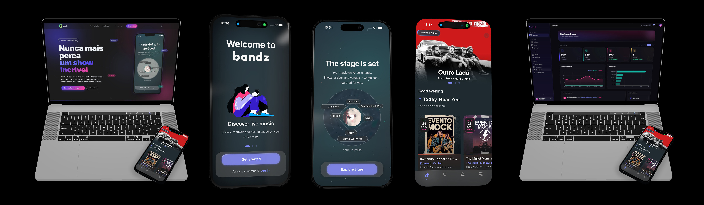

# bandz

Live music discovery platform. Built end-to-end: iOS, Android, backend, admin dashboard, and landing page.

> Curated architecture showcase. Selected files from an active product demonstrating full-stack engineering across mobile and web.

<p align="center">
  
</p>

<p align="center">
  
  
</p>

## The Problem

Discovering live music in a city is fragmented. Events are scattered across Instagram stories, venue websites, and word of mouth. There's no single place to find what's happening tonight based on your actual music taste and location.

## The Solution

bandz matches users with live events using their music preferences (synced from Spotify/Apple Music), location, and followed artists/venues. When a new event is created, the system automatically generates personalized notifications for relevant users.

[bandz.com.br](https://bandz.com.br)

## Ecosystem

| Layer | Stack |
|-------|-------|
| **iOS** | SwiftUI, MVVM + Coordinator, custom DI container, 309 Swift files |
| **Android** | Jetpack Compose, Clean Architecture, Koin DI, Kotlin Coroutines + Flow |
| **Backend** | Firebase Cloud Functions v2 (Node 22, TypeScript 5.8), Firestore, FCM |
| **Admin** | Next.js 15, React 19, Radix UI + shadcn/ui, React Hook Form + Zod |
| **Landing** | Astro 5, Tailwind CSS 4.2, zero-JS-by-default |
| **Monorepo** | Turborepo + pnpm, shared types/schemas/design-tokens package |
| **Security** | Firestore rules with RBAC, Firebase Secret Manager, admin auth guards |

## Architecture

### Shared Types (packages/shared)

All platforms consume the same domain contracts. Zod schemas validate data at runtime on both admin forms and Cloud Functions. Design tokens (colors, typography) are shared between admin and landing.

```
packages/shared/src/
├── types/          # TypeScript interfaces (User, Artist, Event, Place, Banner)
├── schemas/        # Zod validation (event, artist, place, admin, style-group)
├── constants/      # Firestore collection names, notification config
├── design-tokens/  # Colors, typography
└── firestore/      # Type-safe collection mapping
```

### Cloud Functions (apps/functions)

Event-driven backend organized by domain. Services layer separates business logic from function handlers. Secrets managed via Firebase Secret Manager.

Key patterns:
- **Firestore triggers** (on-event-created dispatches notifications matching user preferences)
- **Notification pipeline** (generate → match user preferences/location → dispatch via FCM)
- **RBAC** (admin auth guard with custom claims: superadmin, admin, editor, viewer)
- **Banner selection algorithm** (weighted rotation with pinning and history tracking)

### Admin Dashboard (apps/admin)

Next.js 15 with App Router. CRUD for events, artists, places, clients. Real-time Firestore subscriptions via `useCollection` hook. Permission-based access control with `PermissionGate` components.

Key patterns:
- **Forms** with React Hook Form + Zod schemas (shared with backend validation)
- **Command palette** (Cmd+K global search)
- **Calendar views** (monthly, weekly, daily) for event management
- **Unsaved changes detection** with navigation guards
- **Real-time data tables** with sorting, pagination, and loading states

### Landing (apps/landing)

Astro 5 static site. Hero with parallax, constellation animation, and cursor aurora effect. Multi-language (EN, ES, PT-BR). Theme-aware phone mockups.

### iOS (ios/)

SwiftUI app (iOS 18+) with custom thread-safe DI container using `NSRecursiveLock` and `ObjectIdentifier` resolution. 4 injection patterns: `@Inject`, `@InjectOrDefault`, optional resolution, init injection. Comprehensive design system with 9 subsystems (Color, Typography, Spacing, Elevation, Layout, Animation, Glass, Icons, Text). Premium onboarding flow with Coordinator pattern.

### Android (android/)

Jetpack Compose with Clean Architecture. Koin DI with layered modules (data, domain, presentation). Event discovery use case with Haversine geospatial filtering and performance logging. Material3 theme with dynamic color support.

## Project Structure

```
bandz-showcase/
├── ios/
│   ├── Core/
│   │   ├── DI/              # Custom DIContainer + @Inject + 6 modular registrars
│   │   ├── Theme/           # 9-system design system (Color, Type, Spacing, Elevation, Layout, Animation)
│   │   └── Components/      # Glass effects, shimmer text, toast system
│   ├── Features/
│   │   └── Onboarding/      # Premium multi-step onboarding (Coordinator + ViewModel + Views)
│   └── .swiftlint.yml       # Strict linting with custom rules
│
├── android/
│   ├── di/                   # Koin modules (Data, Domain, Presentation)
│   ├── domain/usecases/      # EventsUseCaseImpl (geospatial filtering, performance metrics)
│   ├── data/repository/      # Firestore repository with Flow
│   ├── presentation/home/    # HomeScreen + ViewModel
│   └── common/
│       ├── theme/            # Material3 design system
│       └── navigation/       # Compose Navigation with transitions
│
├── platform/
│   ├── turbo.json            # Monorepo task pipeline
│   ├── firestore.rules       # RBAC security rules (183 lines)
│   ├── firestore.indexes.json
│   ├── packages/shared/      # Types, Zod schemas, constants, design tokens
│   ├── apps/functions/       # Cloud Functions v2 (notifications, admin, banners)
│   ├── apps/admin/           # Next.js 15 dashboard (forms, hooks, components)
│   └── apps/landing/         # Astro 5 marketing site (Hero, Features)
│
└── README.md
```

## Tech Stack

**iOS:** Swift, SwiftUI, @Observable, MVVM + Coordinator, custom DI, Firebase Auth/Firestore/Messaging

**Android:** Kotlin, Jetpack Compose, Clean Architecture, Koin, Coroutines + Flow, Firebase

**Backend:** TypeScript 5.8, Firebase Functions v2, Node 22, Firestore, FCM, Secret Manager

**Admin:** Next.js 15, React 19, Radix UI, shadcn/ui, React Hook Form, Zod, TailwindCSS

**Landing:** Astro 5, TailwindCSS 4.2

**Monorepo:** Turborepo 2.8, pnpm 10, ESLint 10

## Key Architecture Decisions

**Why a Turborepo monorepo?**
bandz started as 5 separate repos (iOS, Android, Firebase Functions, Angular admin, landing page). Maintaining shared types across repos meant constant drift. Turborepo + pnpm unifies the backend, admin, and landing into a single workspace. The `@bandz/shared` package exports types, Zod schemas, and design tokens consumed by all web apps. Mobile apps (Swift/Kotlin) maintain their own type definitions but follow the same contracts.

**Why Zod schemas shared between admin and functions?**
Form validation on the admin dashboard and input validation on Cloud Functions use the same Zod schemas from `@bandz/shared`. This guarantees that if an event passes the admin form, it will pass the backend validation. No more "works in the UI, fails on save."

**Why custom DI container on iOS instead of Swinject or Factory?**
The container uses `NSRecursiveLock` + `ObjectIdentifier` for thread-safe resolution with zero third-party dependencies. It supports singleton/transient scopes, `@Inject` property wrapper, and modular registrars (6 registrars with explicit registration order). This gives full control over the dependency graph without framework lock-in.

**Why Koin over Hilt on Android?**
Koin is a pure Kotlin solution with no annotation processing. It integrates naturally with Jetpack Compose and doesn't require `@HiltViewModel` or `@AndroidEntryPoint` annotations. For a Compose-first app, the reduced boilerplate outweighs Hilt's compile-time safety.

**Why Firestore triggers for notifications?**
When a new event is created, `onEventCreated` fires automatically and matches it against user preferences (genres, followed artists, followed places) and location. This decouples notification logic from the admin dashboard. Event creators don't need to think about notifications, and the matching algorithm can evolve independently.

**Why RBAC with Firebase Custom Claims?**
Firestore Security Rules check custom claims (superadmin, admin, editor, viewer) on every read/write. This means access control is enforced at the database level, not just the UI. Even if the admin dashboard has a bug, unauthorized users can't write to restricted collections.

## Notes

This repository contains curated architecture samples from an active product. Firebase credentials, API keys, and service accounts are not included. Secrets are managed via Firebase Secret Manager.

---

Built by [Felipe Canhameiro](https://github.com/fecanhameiro) at [Prism Labs](https://prismlabs.studio).
